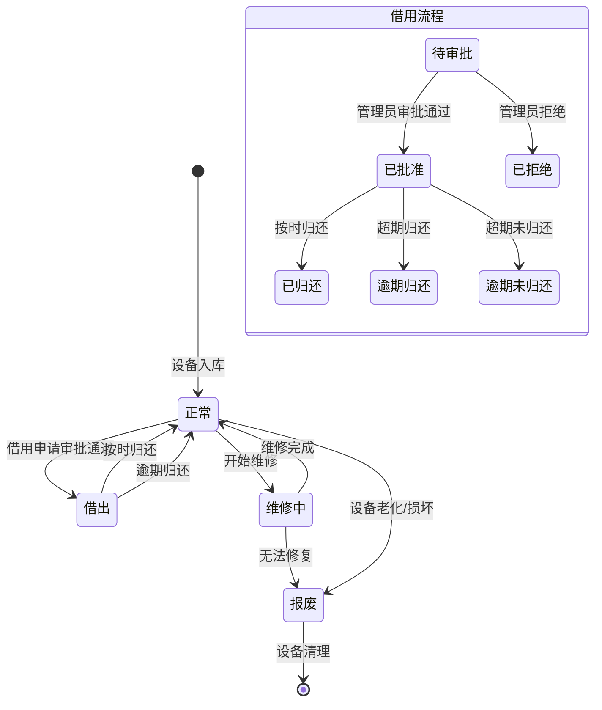

# 设备状态转换流程图

## 设备状态定义

### 设备基本状态
- 正常(1): 设备可正常使用
- 借出(2): 设备已被借用
- 维修中(3): 设备正在维修
- 报废(4): 设备已报废

### 借用状态
- 待审批(0): 借用申请等待审批
- 已批准(1): 借用申请已通过
- 已拒绝(2): 借用申请被拒绝
- 已归还(3): 设备已归还
- 逾期归还(4): 设备逾期归还
- 逾期未归还(5): 设备逾期未归还

## 状态转换流程图

## 状态转换说明

### 借用流程
1. 用户提交借用申请，设备进入待审批状态
2. 管理员审批：
   - 通过：设备状态变更为借出，借用状态为已批准
   - 拒绝：借用状态变为已拒绝，设备状态保持不变
3. 归还处理：
   - 按时归还：借用状态变为已归还，设备状态恢复为正常
   - 逾期归还：借用状态变为逾期归还，设备状态恢复为正常
   - 超期未归还：借用状态变为逾期未归还

### 维修流程
1. 设备需要维修时，状态从正常变更为维修中
2. 维修完成后：
   - 修复成功：状态恢复为正常
   - 无法修复：状态变更为报废

### 报废流程
1. 设备可以从正常或维修中状态转变为报废状态
2. 报废原因：
   - 设备老化
   - 严重损坏
   - 维修无法修复
3. 报废后的设备将进行清理处理